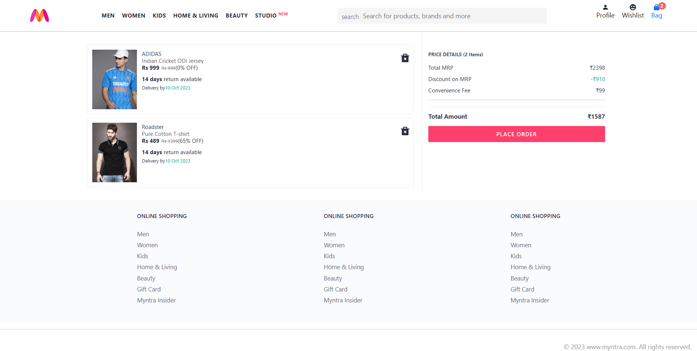

# Myntra Clone — React (Vite) + Redux

**A learning-focused Myntra clone with a fully working dynamic dashboard and shopping bag.**

This project is built primarily to strengthen my skills in **React, Redux Toolkit, Bootstrap, and React Icons**. It demonstrates how Redux can be used to manage global state so that changes made in the dashboard automatically reflect in the shopping bag and summary. The focus is more on frontend development, styling, and state management.

> **Note:** The backend here is very simple — just a basic setup to serve product data. I am still learning backend development and plan to build a proper backend project soon.

---

## Quick highlights

- Dynamic product dashboard (products displayed and managed via Redux)
- Shopping bag that updates automatically when dashboard items change
- Bag summary with live total price and item count
- **Redux Toolkit** for state management (single source of truth)
- **Bootstrap** and **React Icons** for responsive, modern UI

---

## Project structure

```
myntra-clone/
├─ backend/                 # Simple beginner-level backend (product data)
├─ myntra-react-clone/      # React frontend (Vite + Redux)
└─ README.md                # Project readme
```

---

## Prerequisites

- Node.js v16+ (recommended)
- npm (or yarn / pnpm)

---

## Getting started (step-by-step)

1. **Clone the repository**

```bash
git clone https://github.com/hammad-dc/myntra-clone.git
cd myntra-clone
```

2. **Start the backend**

```bash
cd backend
npm install
npm start
```

- The backend is minimal and just serves product data at: `http://localhost:8080/items`.

3. **Start the frontend**

```bash
cd ../myntra-react-clone
npm install
npm run dev
```

- The frontend dev server typically runs at `http://localhost:5173`.

---

## How it works (high level)

1. **Backend**: beginner-level backend that returns product data (JSON). It’s used to provide sample products to the frontend. I’ll be learning backend development more deeply and plan to make a separate backend project soon.

2. **Frontend**: built with **Vite + React + Redux Toolkit**. Product data is fetched and stored in Redux. Both dashboard and bag pages subscribe to the same store, so updates (like adding/removing items) reflect everywhere instantly.

3. **UI & Styling**: designed with **Bootstrap** for responsive layouts and **React Icons** for visuals.

---

## Usage

- Open `http://localhost:5173` in your browser.
- Browse the dashboard and add products to the bag.
- Visit the **Bag page** to view, update, or remove items.
- The **Bag Summary** shows total price and item count in real time.

---

## Developer notes

- Backend is very basic and only for practice. Most of the logic (bag updates, quantity management, etc.) happens in the frontend using Redux.
- My main learning here is **state management with Redux Toolkit** and **responsive UI with Bootstrap**.
- Future backend projects will include databases, authentication, and proper CRUD APIs.

---

## Screenshots

### Dashboard
[Dashboard]: (./screenshots/dashboard.png)

### Shopping Bag (with Summary)


## Future improvements

- Build a full backend with database (MongoDB/Postgres)
- Add user accounts with login/signup
- Save shopping bags persistently per user
- Add product filters, sorting, and search in the dashboard
- Improve UI with advanced Bootstrap components

---

## Contributing

Contributions are welcome! If you’d like to improve the frontend, styling, or add backend features, feel free to open a PR.

---

## License

This project is released under the **MIT License**. See `LICENSE` for details.

---

## Credits

Inspired by Myntra’s UI/UX. Built for learning React, Redux, and frontend design.

